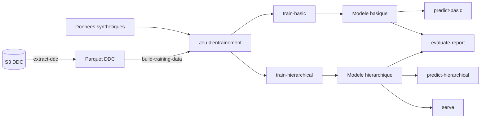
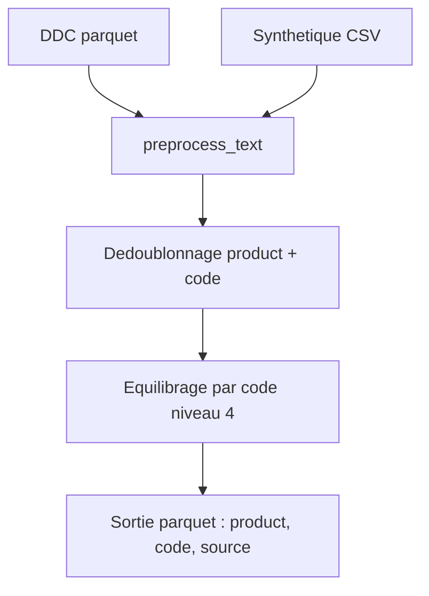
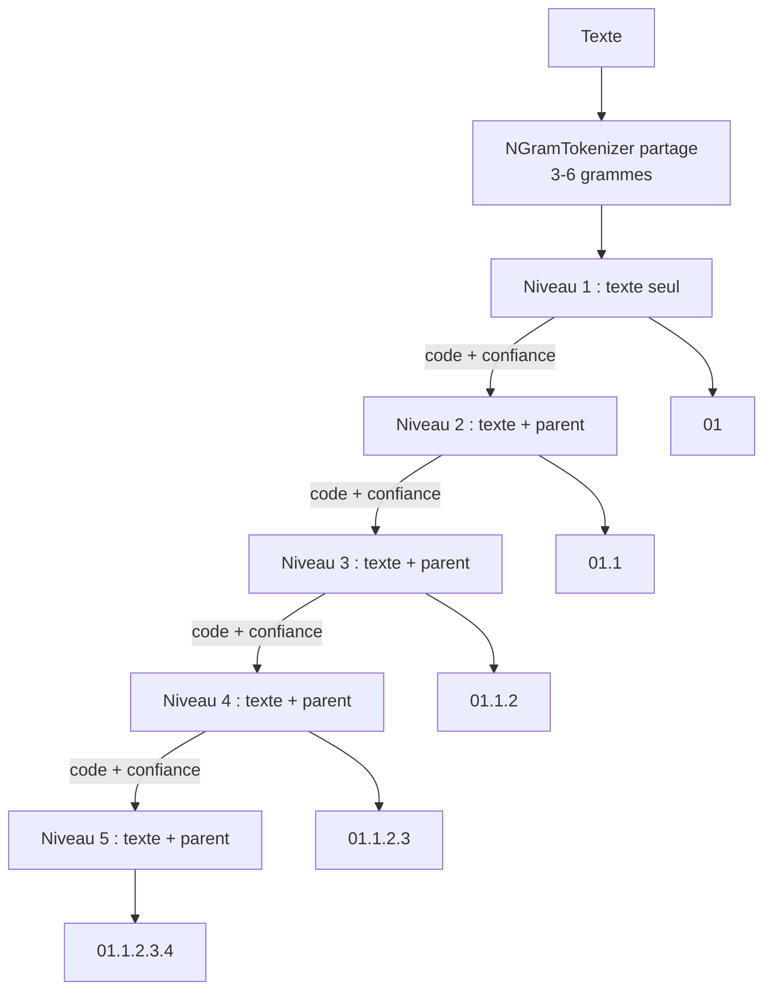

# COICOP BDF Classifier

Classifieur de textes produits vers des codes [COICOP](https://www.insee.fr/fr/information/8616409) (Classification of Individual Consumption According to Purpose), construit pour l'enquête Budget de Famille (BdF) de l'INSEE.

Deux approches de classification sont proposées :

- **Classifieur basique** : classifieur plat unique qui predit directement le code COICOP complet
- **Classifieur hierarchique** : cascade de 5 classifieurs (un par niveau COICOP), ou chaque niveau utilise les predictions du niveau parent comme features supplementaires

Les deux approches utilisent un tokenizer n-grammes de caracteres (3-6 grammes) via la bibliotheque `torchTextClassifiers`.

## Installation

Prerequis : Python 3.13 (voir `.python-version`).

```bash
uv sync
```

## Vue d'ensemble du pipeline



## Extraction des donnees de caisse (`extract-ddc`)

La commande `extract-ddc` extrait les donnees de caisse (DDC) depuis le stockage S3 via DuckDB, applique un mapping COICOP, et produit un fichier parquet pret a l'emploi.

### Fonctionnement

1. **Lecture S3** : les fichiers parquet DDC sont lus depuis `s3://projet-ddc/.../annee={ANNEE}/mois={MOIS}/` pour les annees et mois demandes.
2. **Dedoublonnage** : les lignes sont dedoublonnees sur le triplet `(description_ean, variete, id_famille)`.
3. **Mapping COICOP** :
   - Si la variete commence par `"99"`, le code COICOP est recupere depuis la table `famille_circana.csv` par jointure sur `id_famille`.
   - Sinon, le champ `variete` est utilise directement comme code COICOP.
4. **Filtrage** : seuls les codes COICOP d'au moins 10 caracteres sont conserves, et les codes commencant par `"99"` sont exclus.
5. **Ecriture** : le resultat est ecrit en parquet sur S3.

### Colonnes de sortie

| Colonne | Description |
|---------|-------------|
| `description_ean` | Texte du produit |
| `variete` | Code variete d'origine |
| `coicop_code` | Code COICOP apres mapping |

### Commande CLI

```bash
uv run python main.py extract-ddc \
    --annee 2024 2025 \
    --mois 1 2 3 \
    --famille data/famille_circana.csv \
    --memory 6GB
```

| Argument | Obligatoire | Defaut | Description |
|----------|:-----------:|--------|-------------|
| `--annee` | oui | — | Annee(s) a extraire |
| `--mois` | non | tous les mois | Mois a extraire |
| `--output` | non | `s3://travail/.../ddc_{DATE}.parquet` | Chemin S3 de sortie |
| `--famille` | non | `data/famille_circana.csv` | Fichier CSV de mapping famille Circana |
| `--memory` | non | `6GB` | Limite memoire DuckDB |
| `--dry-run` | non | `False` | Affiche le SQL genere sans l'executer |
| `--encrypt` | non | `False` | Chiffre le parquet de sortie (AES-GCM 256 bits), affiche la cle dans les logs |
| `--encryption-key` | non | `None` | Cle de chiffrement parquet (hex, 32 chars). Implique `--encrypt` |

Le mode `--dry-run` affiche l'integralite du SQL qui serait execute sans se connecter a S3 :

```bash
uv run python main.py extract-ddc --annee 2024 --dry-run
```

## Construction du jeu d'entrainement (`build-training-data`)

La commande `build-training-data` construit un jeu de donnees equilibre pret pour l'entrainement a partir des donnees de caisse (DDC) et de donnees synthetiques.

### Pipeline de pretraitement textuel

Chaque texte passe par la fonction `preprocess_text` (definie dans `src/data_preparation.py`) :


Detail des etapes :

1. **Translitteration Unicode** (`unidecode`) — `"Creme brulee BIO"` → `"Creme brulee BIO"`
2. **Passage en minuscules** — `"Creme brulee BIO"` → `"creme brulee bio"`
3. **Suppression du bruit** (`remove_noise`) — ponctuation, chiffres, mots d'une seule lettre, expressions vides (`"rien"`, `"rien du tout"`)
4. **Deduplication des tokens** (`tokenize_and_clean`) — `"lait lait entier lait"` → `"lait entier"`
5. **Suppression des lignes vides** (`remove_empty_and_strip`)
6. **Suppression des stopwords** — mots courants definis dans `data/text/stopwords.json`

### Logique d'equilibrage

L'equilibrage opere au **niveau 4 de la COICOP** (prefixe forme des 4 premiers segments du code, ex. `01.1.2.3`). Pour chaque code de niveau 4 :

- **Code surrepresente** (lignes DDC > `max_per_code`) → echantillonnage aleatoire de `max_per_code` lignes DDC, pas de donnees synthetiques ajoutees.
- **Code sous-represente** (lignes DDC ≤ `max_per_code`) → conservation de toutes les lignes DDC + ajout de toutes les lignes synthetiques disponibles.
- **Code absent de la DDC** → inclusion de toutes les lignes synthetiques.

### Flux de donnees



### Schema de sortie

| Colonne | Description |
|---------|-------------|
| `product` | Texte du produit pretraite |
| `code` | Code COICOP complet |
| `source` | Origine de la donnee : `"ddc"` ou `"synthetic"` |

### Commande CLI

```bash
uv run python main.py build-training-data \
    --ddc data/raw/ddc.parquet \
    --output data/data-train.parquet \
    --synthetic data/synthetic_data.csv \
    --max-per-code 1000 \
    --seed 42
```

| Argument | Obligatoire | Defaut | Description |
|----------|:-----------:|--------|-------------|
| `--ddc` | oui | — | Chemin vers le parquet DDC (local, S3 ou HTTP) |
| `--output` | oui | — | Chemin du fichier parquet de sortie |
| `--synthetic` | non | `data/synthetic_data.csv` | Chemin vers le CSV de donnees synthetiques (separateur `;`) |
| `--max-per-code` | non | `1000` | Nombre max de lignes DDC par code de niveau 4 |
| `--seed` | non | `42` | Graine aleatoire pour la reproductibilite |
| `--encryption-key` | non | `None` | Cle de chiffrement parquet (hex, 32 chars) pour lire/ecrire des fichiers chiffres |

## Classifieurs

### Classifieur basique (`train-basic`)

Classifieur plat unique qui predit le code COICOP complet directement, sans decomposition hierarchique.


**Quand l'utiliser** : plus simple et plus rapide a entrainer, adapte quand la structure hierarchique n'est pas critique.

#### Commande CLI

```bash
uv run python main.py train-basic \
    --data data/data-train.parquet \
    --output checkpoints/basic \
    --num-epochs 20
```

| Argument | Defaut | Description |
|----------|--------|-------------|
| `--data` | (obligatoire) | Parquet d'entrainement (issu de `build-training-data`) |
| `--output` | `checkpoints/basic` | Repertoire de sortie du modele |
| `--ngram-min` | `3` | Taille minimale des n-grammes |
| `--ngram-max` | `6` | Taille maximale des n-grammes |
| `--ngram-vocab-size` | `100000` | Taille du vocabulaire n-grammes |
| `--embedding-dim` | `128` | Dimension de l'embedding |
| `--max-seq-length` | `64` | Longueur maximale de sequence |
| `--batch-size` | `32` | Taille de batch |
| `--lr` | `0.1` | Taux d'apprentissage |
| `--num-epochs` | `20` | Nombre max d'epoques |
| `--patience` | `5` | Patience pour l'arret precoce |
| `--mlflow-experiment` | `None` | Nom de l'experience MLflow |
| `--eval-data` | `None` | Parquet d'evaluation post-entrainement |
| `--eval-top-k` | `5` | K maximal pour l'evaluation top-k |
| `--encryption-key` | `None` | Cle de chiffrement parquet (hex, 32 chars) pour lire des fichiers chiffres |

### Classifieur hierarchique (`train-hierarchical`)

Cascade de 5 classifieurs, un par niveau COICOP. Chaque niveau N recoit les predictions du niveau N-1 comme features categoriques supplementaires (embedding du code parent + bucket de confiance).



Fonctionnement :

- **Niveau 1** : predit les 13 categories principales (01-13) a partir du texte seul.
- **Niveaux 2-5** : chaque classifieur recoit le texte tokenise + un embedding du code parent predit + un bucket de confiance (discretise en 10 intervalles).
- **Teacher forcing** : pendant l'entrainement, le code parent reel (ground truth) est utilise dans une proportion configurable (defaut : 0.8) au lieu de la prediction du niveau precedent.
- **Tokenizer partage** : un seul `NGramTokenizer` est entraine sur l'ensemble des textes et reutilise a tous les niveaux.

#### Commande CLI

```bash
uv run python main.py train-hierarchical \
    --data data/data-train.parquet \
    --output checkpoints/hierarchical \
    --num-epochs 20
```

| Argument | Defaut | Description |
|----------|--------|-------------|
| `--data` | `data/data-train.parquet` | Donnees d'entrainement (parquet ou csv) |
| `--output` | `checkpoints/hierarchical` | Repertoire de sortie |
| `--ngram-min` | `3` | Taille minimale des n-grammes |
| `--ngram-max` | `6` | Taille maximale des n-grammes |
| `--ngram-vocab-size` | `100000` | Taille du vocabulaire |
| `--embedding-dim` | `128` | Dimension de l'embedding |
| `--max-seq-length` | `64` | Longueur maximale de sequence |
| `--batch-size` | `32` | Taille de batch |
| `--lr` | `2e-5` | Taux d'apprentissage |
| `--num-epochs` | `20` | Nombre max d'epoques |
| `--patience` | `5` | Patience pour l'arret precoce |
| `--min-samples` | `50` | Nombre minimum d'exemples par niveau |
| `--teacher-forcing-ratio` | `0.8` | Ratio de teacher forcing (0.0-1.0) |
| `--no-parent-features` | — | Desactive les features parentales |
| `--resume` | `False` | Reprend l'entrainement depuis le dernier checkpoint |
| `--mlflow-experiment` | `None` | Nom de l'experience MLflow |
| `--eval-data` | `None` | Parquet d'evaluation post-entrainement |
| `--encryption-key` | `None` | Cle de chiffrement parquet (hex, 32 chars) pour lire des fichiers chiffres |

#### Fine-tuning (`fine-tune-hierarchical`)

Permet d'affiner un modele hierarchique pre-entraine sur de nouvelles donnees. On peut cibler des niveaux specifiques a re-entrainer.

```bash
uv run python main.py fine-tune-hierarchical \
    --model checkpoints/hierarchical/hierarchical_model \
    --data data/new-data.parquet \
    --output checkpoints/fine-tuned \
    --levels level3,level4,level5
```

| Argument | Defaut | Description |
|----------|--------|-------------|
| `--model` | (obligatoire) | Chemin du modele pre-entraine |
| `--data` | (obligatoire) | Nouvelles donnees d'entrainement |
| `--output` | (obligatoire) | Repertoire de sortie |
| `--levels` | tous | Niveaux a affiner (ex: `level3,level4`) |
| `--lr` | lr original / 10 | Taux d'apprentissage |
| `--num-epochs` | `5` | Nombre d'epoques |
| `--patience` | `3` | Patience pour l'arret precoce |
| `--encryption-key` | `None` | Cle de chiffrement parquet (hex, 32 chars) pour lire des fichiers chiffres |

#### Reprise apres crash (`--resume`)

Si l'entrainement hierarchique est interrompu, l'option `--resume` permet de reprendre depuis le dernier checkpoint sauvegarde. Les niveaux deja entraines sont sautes automatiquement.

```bash
uv run python main.py train-hierarchical \
    --data data/data-train.parquet \
    --output checkpoints/hierarchical \
    --resume
```

## Prediction

### Prediction hierarchique

```bash
# Texte(s) en ligne de commande
uv run python main.py predict-hierarchical \
    --model checkpoints/hierarchical/hierarchical_model \
    "pain complet bio" "bouteille eau minerale"

# Depuis un fichier
uv run python main.py predict-hierarchical \
    --model checkpoints/hierarchical/hierarchical_model \
    --file input.csv \
    --output predictions.csv \
    --top-k 3
```

| Argument | Defaut | Description |
|----------|--------|-------------|
| `--model` | `checkpoints/hierarchical/hierarchical_model` | Chemin du modele |
| `--file` | `None` | Fichier d'entree pour la prediction par lot |
| `--output` | `predictions_hierarchical.csv` | Fichier de sortie |
| `--text-column` | `product` | Colonne contenant le texte |
| `--batch-size` | `64` | Taille de batch |
| `--top-k` | `1` | Nombre de predictions par niveau |
| `--confidence-threshold` | `None` | Seuil de confiance minimal par niveau |

### Prediction basique

```bash
uv run python main.py predict-basic \
    --model checkpoints/basic/basic_model \
    "pain complet bio"
```

| Argument | Defaut | Description |
|----------|--------|-------------|
| `--model` | `checkpoints/basic/basic_model` | Chemin du modele |
| `--file` | `None` | Fichier d'entree |
| `--output` | `predictions_basic.csv` | Fichier de sortie |
| `--top-k` | `1` | Nombre de predictions |

## Evaluation

### Rapport d'evaluation (`evaluate-report`)

Genere un rapport complet sur des donnees annotees (repertoire `data/annotated/`). Metriques calculees : accuracy, F1, top-k accuracy, ventilees par niveau COICOP, source, montant et type de magasin.

```bash
uv run python main.py evaluate-report \
    --model checkpoints/basic/basic_model \
    --data-dir data/annotated \
    --top-k 5 \
    --output rapport.txt
```

| Argument | Defaut | Description |
|----------|--------|-------------|
| `--model` | `checkpoints/basic/basic_model` | Chemin du modele |
| `--data-dir` | `data/annotated` | Repertoire contenant les CSV annotes |
| `--top-k` | `5` | K maximal pour l'accuracy top-k |
| `--output` | `None` | Fichier de sortie du rapport |
| `--mlflow-run-id` | `None` | Run MLflow existant pour y enregistrer les metriques |
| `--mlflow-experiment` | `None` | Experience MLflow (cree un nouveau run) |
| `--amount-threshold` | `200` | Seuil de depense en euros |

### Top-k accuracy (`topk_accuracy.py`)

Script autonome pour calculer la top-k accuracy a partir d'un parquet de predictions :

```bash
uv run python topk_accuracy.py predictions.parquet --top-k 5
```

## Serveur API (`serve`)

Demarre un serveur FastAPI servant le modele hierarchique.

```bash
uv run python main.py serve \
    --model checkpoints/hierarchical/hierarchical_model \
    --host 0.0.0.0 \
    --port 8000
```

### Endpoints

| Methode | Endpoint | Description |
|---------|----------|-------------|
| `GET` | `/health` | Etat du serveur et du modele |
| `GET` | `/model/info` | Informations sur le modele (niveaux, nombre de classes) |
| `POST` | `/predict` | Prediction pour un texte unique |
| `POST` | `/predict/batch` | Prediction par lot (max 1024 textes) |
| `GET` | `/` | Interface web (frontend statique) |

### Exemple de requete

```bash
curl -X POST http://localhost:8000/predict \
    -H "Content-Type: application/json" \
    -d '{"text": "pain complet bio", "top_k": 3}'
```

## Integration MLflow

Activer le suivi MLflow en passant `--mlflow-experiment` a n'importe quelle commande d'entrainement :

```bash
uv run python main.py train-basic \
    --data data/data-train.parquet \
    --output checkpoints/basic \
    --mlflow-experiment "coicop-basic" \
    --eval-data data/data-eval.parquet
```

**Elements enregistres :**

- **Parametres** : hyperparametres du modele et du tokenizer, nombre d'echantillons, nombre de classes
- **Metriques** : nombre de classes et echantillons par niveau, metriques d'evaluation top-k (si `--eval-data` fourni)
- **Artefacts** : modele sauvegarde, poids des classifieurs
- **Pyfunc** (classifieur basique uniquement) : wrapper `mlflow.pyfunc` pour le serving bout-en-bout

## Structure du projet

```
coicop_bdf_classifier/
├── main.py                        # Point d'entree CLI
├── pyproject.toml                 # Dependances (uv)
├── topk_accuracy.py               # Script top-k accuracy
├── src/
│   ├── __init__.py
│   ├── api.py                     # Serveur FastAPI
│   ├── basic_classifier.py        # Classifieur plat (n-grammes)
│   ├── build_training_data.py     # Construction du jeu d'entrainement
│   ├── cascade_classifier.py      # Classifieur cascade (CamemBERT, legacy)
│   ├── classifier.py              # Classe de base
│   ├── data_preparation.py        # Pretraitement et chargement des donnees
│   ├── evaluation_report.py       # Rapport d'evaluation complet
│   ├── extract_ddc.py             # Extraction DDC depuis S3
│   ├── hierarchical_classifier.py # Classifieur hierarchique 5 niveaux
│   ├── mlflow_utils.py            # Utilitaires MLflow (pyfunc wrapper)
│   ├── predict.py                 # Modules de prediction
│   ├── train.py                   # Orchestration de l'entrainement
│   └── static/
│       └── index.html             # Interface web
├── data/
│   ├── annotated/                 # Donnees annotees pour l'evaluation
│   ├── famille_circana.csv        # Mapping famille Circana → COICOP
│   ├── synthetic_data.csv         # Donnees synthetiques
│   └── text/
│       └── stopwords.json         # Stopwords pour le pretraitement
└── docs/
    └── fine_tuning.md             # Documentation du fine-tuning
```
